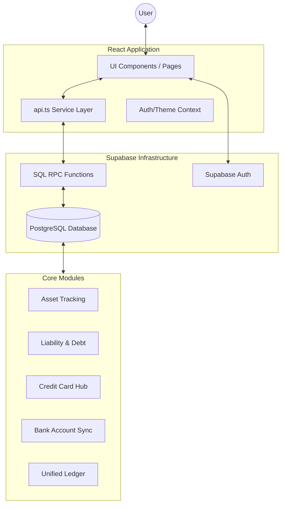

# Finthesia: Personal Finance Command Center
## Technical & Design Architecture

Finthesia is a premium, AI-powered personal finance platform designed for high-net-worth tracking, credit card optimization, and automated financial insights.

---

### 1. Core Objectives
- **Single Source of Truth (SSOT)**: Unified data layer ensuring consistency across assets, liabilities, and transactions.
- **Premium Aesthetics**: Modern, data-dense interface using "Bento box" layouts and glassmorphism.
- **Credit Card Optimization**: Deep tracking of limits, utilization, and rewards to maximize financial efficiency.
- **Automated Intelligence**: AI-driven categorization and spending predictions.

---

### 2. Technology Stack
| Layer | Technology |
| :--- | :--- |
| **Frontend** | React 18, Vite, TypeScript |
| **Styling** | TailwindCSS, Framer Motion (Animations) |
| **Database** | Supabase (PostgreSQL) |
| **Authentication** | Supabase Auth (OTP, Email/Password) |
| **Logic Layer** | Supabase RPCs (Stored Procedures for Atomic Sync) |
| **Design Tokens** | Custom CSS Variables in `index.css` |

---

### 3. System Architecture

---

### 4. Database Schema & Data Models
The system uses a relational PostgreSQL schema with cross-module synchronization logic.

#### Core Entities:
- **Banks**: Savings/Current accounts with balance tracking.
- **Cards**: Credit cards with limits, billing cycles, and utilization alerts.
- **Assets**: Real estate, Investments, and custom assets.
- **Liabilities**: Loans (Home, Personal) and EMIs linked to credit cards.
- **Transactions**: Unified ledger (Income, Expense, Payment, Spend).
- **Bank Transactions**: Records imported via CSV or manual entry, synced to bank balances.

---

### 5. Design System

#### Color Palette
- **Primary**: `#27C4E1` (Cyan)
- **Secondary**: `#00BFFF` (Deep Sky Blue)
- **Text (Dark)**: `#545E63` (Slate)
- **Background**: `#F6F7F9` (Light Grey) / `#111827` (Dark Mode)

#### Typography
- **Primary Font**: `Inter` (sans-serif)
- **Heading Styles**: Bold, high-contrast weights for premium feel.

#### UI Components
- **Bento Cards**: `rounded-[2.5rem]` with subtle `shadow-sm` and hover transformations.
- **Glassmorphism**: Translucent headers and overlays for depth.
- **Animations**: `slamIn` keyframes for page transitions and micro-interactions.

---

### 6. Key Features & Workflows

#### 📈 Net Worth Center
Calculates real-time Net Worth by aggregating all active Assets and subtracting all active Liabilities (including card debts).

#### 💳 Credit Card Hub
- **Optimization**: Tracks utilization versus limits.
- **EMI Management**: Automated card balance blocking for EMI-linked purchases.
- **Statements**: Reminders for billing cycles and payment due dates.

#### 🤖 AI Insights
- **Category Detection**: Keyword-based auto-categorization for imported transactions.
- **Health Scoring**: Dynamic financial health score based on debt-to-income and savings rates.
- **Predictions**: Predictive analysis of monthly spending trends.

---

### 7. Security & Integrity
- **Write-Time Sync**: Transactions utilize Supabase RPCs to atomically update bank/card balances during creation or deletion.
- **Row Level Security (RLS)**: Enforced at the database level to ensure users only access their own data.
- **Data Derivation**: Summary views (e.g., Debt Summary) are derived dynamically to prevent stale data.
